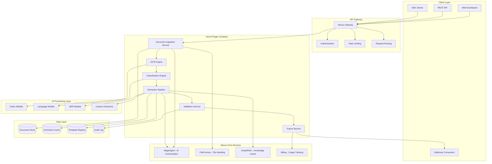
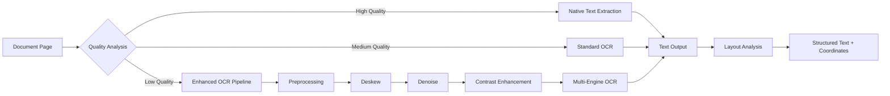
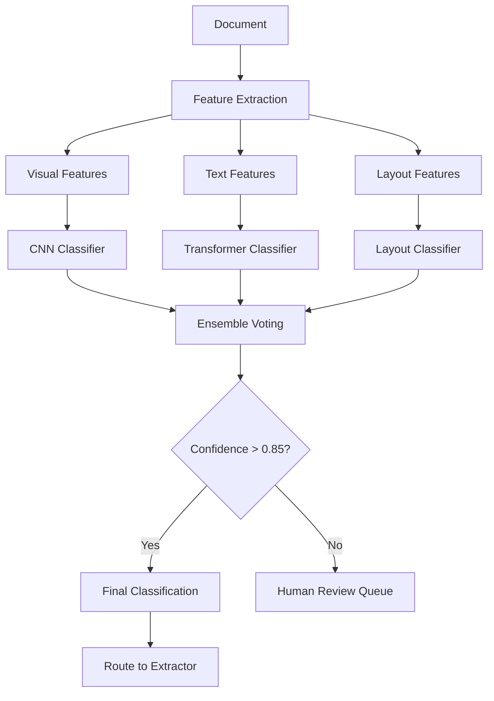
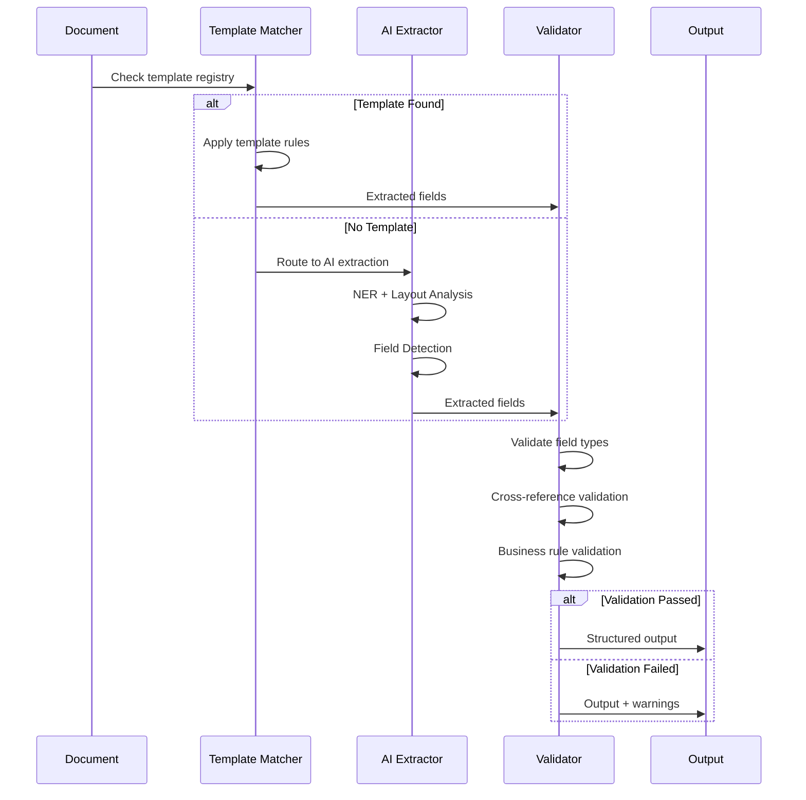
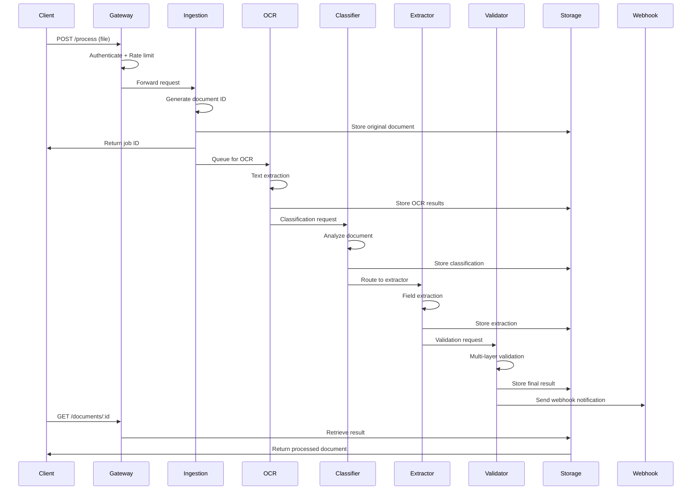
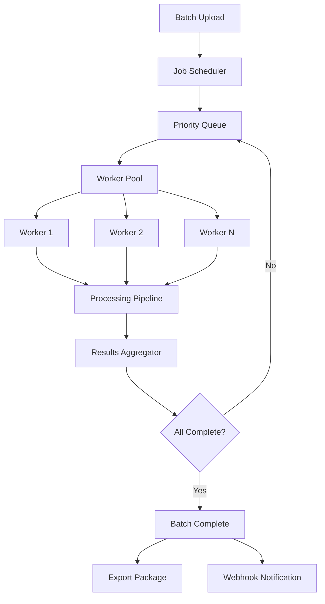
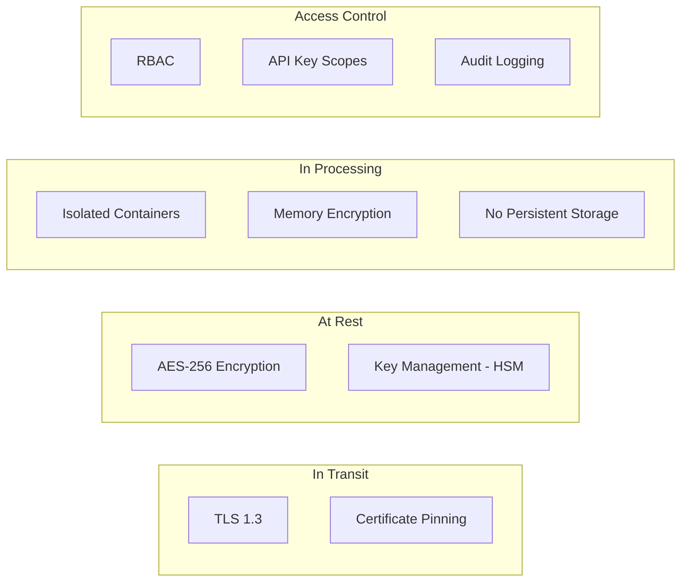
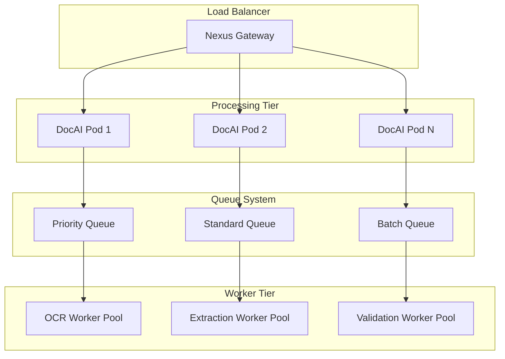
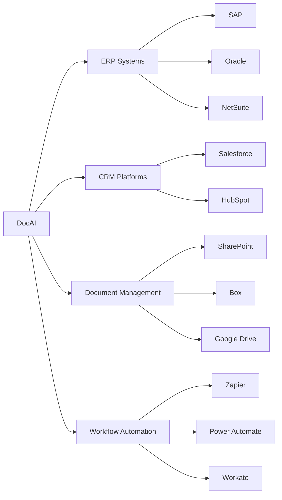

# Architecture Guide - DocAI

Technical architecture and system design for DocAI - Intelligent Document Processing.

---

## System Overview

DocAI is built on a modular, microservices architecture designed for high throughput, accuracy, and scalability. The system processes documents through a multi-stage pipeline that combines OCR, AI-powered extraction, classification, and validation.



---

## Core Components

### 1. Document Ingestion Service

The ingestion service handles document upload, format detection, and preprocessing.

**Responsibilities:**
- Accept documents via API upload, URL fetch, or S3/GCS bucket
- Detect file format and validate against supported types
- Generate document ID and create processing job
- Route to appropriate processing pipeline based on document characteristics

**Supported Formats:**

| Format | Extensions | Max Size | Notes |
|--------|-----------|----------|-------|
| PDF | .pdf | 50MB | Native text + scanned |
| Images | .png, .jpg, .jpeg, .tiff, .bmp | 25MB | Auto-deskew enabled |
| Office | .docx, .xlsx | 25MB | Converted to PDF |
| Email | .eml, .msg | 10MB | Attachments extracted |

### 2. OCR Engine

Multi-engine OCR system optimized for different document types and quality levels.



**OCR Capabilities:**
- 100+ language support including CJK character sets
- Handwriting recognition for printed and cursive text
- Table structure preservation with cell boundary detection
- Mathematical formula recognition
- Barcode and QR code extraction

### 3. Classification Engine

AI-powered document classification with hierarchical taxonomy support.

**Classification Architecture:**



**Supported Document Categories:**

| Category | Document Types | Model Accuracy |
|----------|---------------|----------------|
| Financial | Invoice, Receipt, PO, Statement | 99.2% |
| Legal | Contract, NDA, Agreement | 98.7% |
| Healthcare | Claim, Medical Record, Prescription | 98.4% |
| Identity | Passport, License, ID Card | 99.5% |
| HR | Resume, W-2, I-9, Offer Letter | 98.1% |

### 4. Extraction Pipeline

Multi-stage extraction pipeline combining template matching and AI-powered extraction.



**Extraction Methods:**

| Method | Use Case | Speed | Accuracy |
|--------|----------|-------|----------|
| Template Matching | High-volume, consistent formats | Fast | 99%+ |
| AI Extraction | Variable formats, unknown layouts | Medium | 95%+ |
| Hybrid | Known vendors with variations | Fast | 98%+ |
| Custom Models | Domain-specific documents | Medium | 97%+ |

### 5. Validation Service

Multi-layer validation ensuring data quality and consistency.

**Validation Layers:**

1. **Schema Validation**: Field types, required fields, format patterns
2. **Mathematical Validation**: Sum verification, tax calculations
3. **Cross-Reference Validation**: Match against master data, previous documents
4. **Business Rule Validation**: Custom rules per document type
5. **Anomaly Detection**: Flag unusual values or patterns

### 6. Export Service

Flexible export to multiple formats and destinations.

**Export Formats:**
- JSON (structured data)
- XML (configurable schema)
- CSV (tabular data)
- Webhook (real-time push)
- Direct integration (ERP, CRM, custom APIs)

---

## Data Flow

### Document Processing Flow



### Batch Processing Flow



---

## Security Model

### Data Protection



### Security Features

| Layer | Protection | Implementation |
|-------|------------|----------------|
| Transport | TLS 1.3 | Mandatory HTTPS, HSTS |
| Authentication | API Keys + JWT | Scoped permissions, rotation |
| Authorization | RBAC | Per-document access control |
| Encryption | AES-256 | Customer-managed keys available |
| Isolation | Container | No cross-tenant data access |
| Audit | Immutable logs | All operations logged |
| Compliance | SOC2, HIPAA | Certified annually |

### Data Retention

- **Processing Data**: Deleted after 24 hours (configurable)
- **Extraction Results**: Retained per customer policy
- **Audit Logs**: 7-year retention
- **Original Documents**: Customer-controlled retention

---

## API Reference

### Base URL
```
https://api.adverant.ai/proxy/nexus-doc/api/v1/doc
```

### Authentication
```bash
Authorization: Bearer YOUR_API_KEY
```

### Endpoints

| Method | Endpoint | Description |
|--------|----------|-------------|
| `POST` | `/process` | Upload and process document |
| `POST` | `/classify` | Classify document type only |
| `POST` | `/extract` | Extract data from document |
| `GET` | `/documents/:id` | Get processed document |
| `GET` | `/documents/:id/status` | Get processing status |
| `DELETE` | `/documents/:id` | Delete document |
| `POST` | `/batch` | Create batch job |
| `GET` | `/batch/:id` | Get batch status |
| `POST` | `/templates` | Create extraction template |
| `GET` | `/templates` | List templates |
| `GET` | `/templates/:id` | Get template details |
| `PUT` | `/templates/:id` | Update template |
| `DELETE` | `/templates/:id` | Delete template |

### Process Document

```bash
POST /process
Content-Type: multipart/form-data

file: <binary>
documentType: invoice | contract | receipt | form | auto
extractionMode: structured | freeform
options: {
  "language": "en",
  "ocrEnabled": true,
  "templateId": "tpl_xxx",
  "webhook": "https://your-server.com/webhook"
}
```

**Response:**
```json
{
  "documentId": "doc_7f3a9b2c",
  "status": "processing",
  "estimatedTime": 8,
  "pages": 2,
  "createdAt": "2024-01-15T10:30:00Z"
}
```

### Get Document

```bash
GET /documents/:id
```

**Response:**
```json
{
  "documentId": "doc_7f3a9b2c",
  "status": "completed",
  "classification": {
    "type": "invoice",
    "confidence": 0.98
  },
  "extraction": {
    "vendor": { ... },
    "invoiceNumber": "INV-001",
    "total": 1250.00,
    "lineItems": [ ... ]
  },
  "validation": {
    "passed": true,
    "warnings": []
  },
  "metadata": {
    "pages": 2,
    "processingTime": 6.2,
    "ocrConfidence": 0.96
  }
}
```

---

## Scaling Architecture

### Horizontal Scaling



### Performance Specifications

| Metric | Starter | Professional | Enterprise |
|--------|---------|--------------|------------|
| Concurrent Jobs | 5 | 20 | Custom |
| Processing Timeout | 5 min | 5 min | 10 min |
| Max File Size | 25MB | 50MB | 100MB |
| Throughput | 100 pages/hr | 1,000 pages/hr | 10,000+ pages/hr |
| SLA Uptime | 99% | 99.5% | 99.99% |

### Resource Allocation

```yaml
# Kubernetes resource configuration
resources:
  cpuMillicores: 2000
  memoryMB: 4096
  diskGB: 20
  timeoutMs: 300000
  maxConcurrentJobs: 20
```

---

## Integration Points

### Nexus Core Services

| Service | Integration | Purpose |
|---------|------------|---------|
| MageAgent | AI orchestration | LLM inference for extraction |
| FileProcess | File handling | Upload, conversion, storage |
| GraphRAG | Knowledge cache | Template and extraction caching |
| Billing | Usage tracking | Page count, API call metering |

### External Integrations



### Webhook Events

```json
{
  "event": "document.processed",
  "documentId": "doc_7f3a9b2c",
  "timestamp": "2024-01-15T10:31:00Z",
  "status": "completed",
  "data": {
    "classification": "invoice",
    "extractionComplete": true,
    "validationPassed": true
  }
}
```

**Available Events:**
- `document.processed` - Processing completed
- `document.failed` - Processing failed
- `document.validation_warning` - Validation issues detected
- `batch.completed` - Batch job completed
- `template.trained` - Custom template ready

---

## Monitoring and Observability

### Metrics

| Metric | Description | Alert Threshold |
|--------|-------------|-----------------|
| `doc_processing_time` | End-to-end processing duration | > 30s |
| `doc_ocr_confidence` | OCR quality score | < 0.8 |
| `doc_extraction_accuracy` | Field extraction accuracy | < 0.95 |
| `doc_queue_depth` | Pending jobs in queue | > 100 |
| `doc_error_rate` | Processing failure rate | > 1% |

### Health Endpoints

```bash
# Liveness check
GET /live
# Returns 200 if service is running

# Readiness check
GET /ready
# Returns 200 if service can accept requests

# Health check with details
GET /health
# Returns detailed health status
```

---

## Next Steps

- **[Quick Start](QUICKSTART.md)**: Get started in 10 minutes
- **[Use Cases](USE-CASES.md)**: Industry implementation examples
- **[API Reference](docs/api-reference/endpoints.md)**: Complete endpoint documentation
