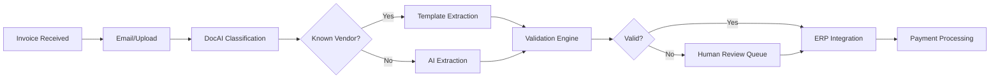
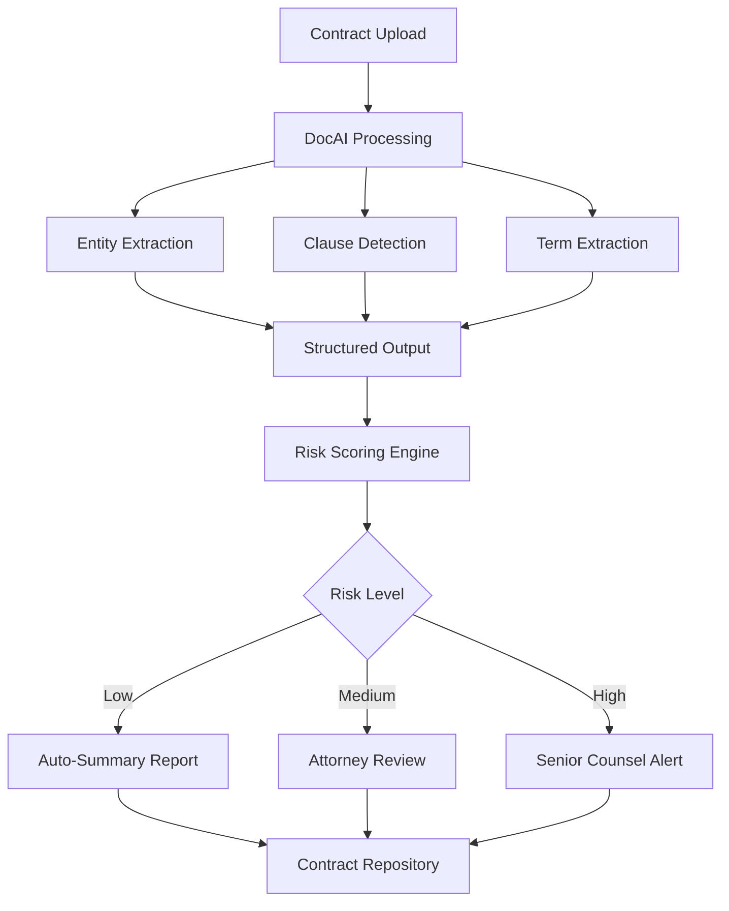
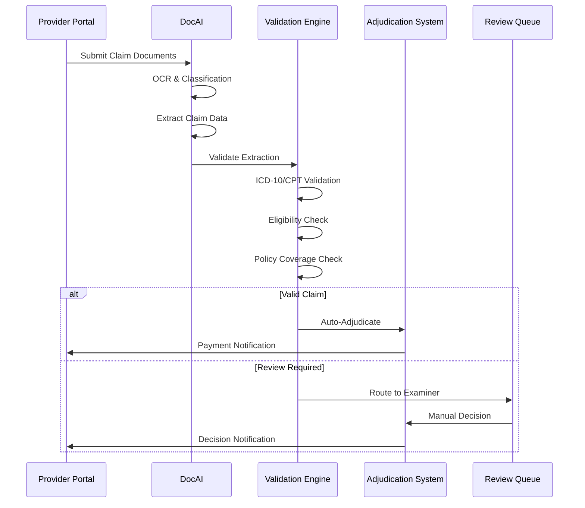
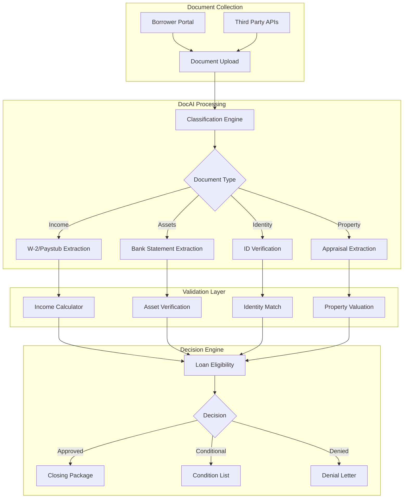
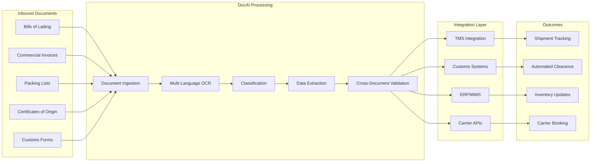

# Industry Use Cases - DocAI

Real-world implementations of DocAI - Intelligent Document Processing across industries.

---

## 1. Accounts Payable Automation

### Problem

A mid-size manufacturing company processes 3,000+ invoices monthly from 200+ vendors. Manual data entry requires a team of 5 AP clerks, with processing times averaging 8 minutes per invoice. Error rates exceed 4%, causing payment delays and vendor relationship issues.

### Solution



### Implementation

```typescript
import { NexusClient } from '@adverant/nexus-sdk';

const client = new NexusClient({ apiKey: process.env.NEXUS_API_KEY });
const doc = client.plugin('nexus-doc');

async function processAPInvoice(invoiceFile: Buffer, vendorId?: string) {
  // Process with vendor-specific template if available
  const result = await doc.process({
    file: invoiceFile,
    documentType: 'invoice',
    extractionMode: 'structured',
    options: {
      templateId: vendorId ? `template_${vendorId}` : undefined,
      validateMath: true,
      crossReference: {
        purchaseOrders: true,
        vendorMaster: true
      }
    }
  });

  // Auto-approve if confidence > 95% and math validates
  if (result.validation.mathCorrect &&
      result.classification.confidence > 0.95 &&
      result.validation.poMatch) {

    await erpSystem.createPayable({
      vendorId: result.extraction.vendor.id,
      invoiceNumber: result.extraction.invoiceNumber,
      amount: result.extraction.total,
      dueDate: result.extraction.dueDate,
      lineItems: result.extraction.lineItems,
      sourceDocument: result.documentId
    });

    return { status: 'auto_approved', documentId: result.documentId };
  }

  // Route to human review
  return {
    status: 'review_required',
    documentId: result.documentId,
    issues: result.validation.warnings
  };
}
```

### Results

| Metric | Before | After | Improvement |
|--------|--------|-------|-------------|
| Processing Time | 8 min/invoice | 45 sec/invoice | 91% reduction |
| Error Rate | 4.2% | 0.3% | 93% reduction |
| Staff Required | 5 FTEs | 1 FTE | 80% reduction |
| Monthly Cost | $32,000 | $8,500 | 73% savings |
| Vendor Satisfaction | 72% | 94% | +22 points |

---

## 2. Legal Contract Analysis

### Problem

A corporate legal department reviews 500+ contracts annually for M&A due diligence. Each contract requires 2-4 hours of attorney time to identify key terms, obligations, and risk factors. Critical deadlines are frequently missed due to backlog.

### Solution



### Implementation

```python
from nexus_sdk import NexusClient
from datetime import datetime, timedelta

client = NexusClient(api_key=os.environ['NEXUS_API_KEY'])
doc = client.plugin('nexus-doc')

def analyze_contract(contract_path: str) -> dict:
    """
    Analyze contract for key terms, obligations, and risks.
    """
    with open(contract_path, 'rb') as f:
        result = doc.extract(
            file=f,
            document_type='contract',
            fields=[
                'parties',
                'effective_date',
                'termination_date',
                'payment_terms',
                'indemnification_clauses',
                'limitation_of_liability',
                'governing_law',
                'dispute_resolution',
                'change_of_control',
                'non_compete',
                'confidentiality',
                'termination_for_cause',
                'termination_for_convenience'
            ],
            options={
                'identify_non_standard_clauses': True,
                'compare_to_standard_template': 'enterprise_services_v2',
                'risk_assessment': True
            }
        )

    # Calculate upcoming obligations
    obligations = []
    for clause in result.extraction.get('obligations', []):
        if clause.get('deadline'):
            deadline = datetime.fromisoformat(clause['deadline'])
            if deadline <= datetime.now() + timedelta(days=90):
                obligations.append({
                    'description': clause['description'],
                    'deadline': deadline,
                    'priority': 'high' if deadline <= datetime.now() + timedelta(days=30) else 'medium'
                })

    return {
        'document_id': result.document_id,
        'summary': result.summary,
        'key_terms': result.extraction,
        'risk_score': result.risk_assessment.score,
        'risk_factors': result.risk_assessment.factors,
        'non_standard_clauses': result.non_standard_clauses,
        'upcoming_obligations': obligations
    }

def batch_due_diligence(contract_paths: list) -> dict:
    """
    Process multiple contracts for M&A due diligence.
    """
    results = {
        'contracts_analyzed': 0,
        'high_risk': [],
        'key_findings': [],
        'aggregate_obligations': []
    }

    for path in contract_paths:
        analysis = analyze_contract(path)
        results['contracts_analyzed'] += 1

        if analysis['risk_score'] > 0.7:
            results['high_risk'].append({
                'document': path,
                'risk_factors': analysis['risk_factors']
            })

        results['aggregate_obligations'].extend(analysis['upcoming_obligations'])

    return results
```

### Results

| Metric | Before | After | Improvement |
|--------|--------|-------|-------------|
| Review Time | 3 hours/contract | 25 min/contract | 86% reduction |
| Due Diligence Cycle | 6 weeks | 10 days | 77% faster |
| Missed Obligations | 12/year | 0/year | 100% reduction |
| Attorney Utilization | 40% strategic work | 75% strategic work | +35 points |
| Cost per Contract | $450 | $85 | 81% savings |

---

## 3. Healthcare Claims Processing

### Problem

A regional health insurance provider processes 50,000+ claims monthly. Manual review bottlenecks cause 15-day average processing times. Coding errors result in $2.3M annual claim denials and rework costs.

### Solution



### Implementation

```typescript
import { NexusClient } from '@adverant/nexus-sdk';

const client = new NexusClient({ apiKey: process.env.NEXUS_API_KEY });
const doc = client.plugin('nexus-doc');

interface ClaimDocument {
  type: 'CMS1500' | 'UB04' | 'EOB' | 'medical_record';
  file: Buffer;
}

interface ProcessedClaim {
  claimId: string;
  patientInfo: PatientInfo;
  procedures: ProcedureCode[];
  diagnoses: DiagnosisCode[];
  totalBilled: number;
  status: 'auto_approved' | 'review_required' | 'denied';
}

async function processHealthcareClaim(documents: ClaimDocument[]): Promise<ProcessedClaim> {
  // Process all claim documents
  const extractions = await Promise.all(
    documents.map(d => doc.process({
      file: d.file,
      documentType: d.type,
      extractionMode: 'structured',
      options: {
        hipaaCompliant: true,
        validateCodes: true,
        codesets: ['ICD-10-CM', 'CPT', 'HCPCS']
      }
    }))
  );

  // Merge extractions from multiple documents
  const mergedData = mergeClaimData(extractions);

  // Validate against policy rules
  const validation = await validateClaim(mergedData);

  // Auto-adjudicate if all validations pass
  if (validation.eligible &&
      validation.covered &&
      validation.codesValid &&
      validation.duplicateCheck === 'clear') {

    const payment = calculatePayment(mergedData, validation.coverageDetails);

    return {
      claimId: generateClaimId(),
      ...mergedData,
      status: 'auto_approved',
      paymentAmount: payment.amount,
      adjudicationDetails: payment.breakdown
    };
  }

  // Route to appropriate review queue
  return {
    claimId: generateClaimId(),
    ...mergedData,
    status: 'review_required',
    reviewReasons: validation.issues,
    assignedQueue: determineReviewQueue(validation.issues)
  };
}

async function validateClaim(claimData: MergedClaimData) {
  // Validate ICD-10 and CPT code combinations
  const codeValidation = await doc.validate({
    type: 'medical_codes',
    data: {
      diagnoses: claimData.diagnoses,
      procedures: claimData.procedures
    },
    rules: [
      'valid_icd10_format',
      'valid_cpt_format',
      'procedure_diagnosis_alignment',
      'gender_specific_codes',
      'age_appropriate_codes'
    ]
  });

  return {
    codesValid: codeValidation.passed,
    issues: codeValidation.issues,
    eligible: await checkEligibility(claimData.patientInfo),
    covered: await checkCoverage(claimData.procedures),
    duplicateCheck: await checkDuplicate(claimData)
  };
}
```

### Results

| Metric | Before | After | Improvement |
|--------|--------|-------|-------------|
| Processing Time | 15 days | 2 days | 87% reduction |
| Auto-Adjudication Rate | 0% | 68% | N/A |
| Coding Errors | 8.5% | 1.2% | 86% reduction |
| Denial Rework Cost | $2.3M/year | $380K/year | 83% savings |
| Provider Satisfaction | 61% | 89% | +28 points |

---

## 4. Mortgage Document Processing

### Problem

A mortgage lender processes 2,000 loan applications monthly. Each application involves 50+ documents requiring verification. Manual document review takes 5 days per application, causing loan approval delays and competitive disadvantage.

### Solution



### Implementation

```python
from nexus_sdk import NexusClient
from typing import List, Dict
import asyncio

client = NexusClient(api_key=os.environ['NEXUS_API_KEY'])
doc = client.plugin('nexus-doc')

class MortgageDocumentProcessor:
    """
    Process mortgage application documents for automated underwriting.
    """

    DOCUMENT_TYPES = {
        'income': ['w2', 'paystub', 'tax_return', 'employment_letter'],
        'assets': ['bank_statement', 'investment_statement', 'retirement_account'],
        'identity': ['drivers_license', 'passport', 'social_security_card'],
        'property': ['appraisal', 'title_report', 'insurance_declaration']
    }

    async def process_application(self, application_id: str, documents: List[Dict]) -> Dict:
        """Process all documents for a mortgage application."""

        # Classify and route all documents
        classified = await self._classify_documents(documents)

        # Process each category in parallel
        results = await asyncio.gather(
            self._process_income_documents(classified.get('income', [])),
            self._process_asset_documents(classified.get('assets', [])),
            self._process_identity_documents(classified.get('identity', [])),
            self._process_property_documents(classified.get('property', []))
        )

        income_data, asset_data, identity_data, property_data = results

        # Calculate qualifying metrics
        qualifying_income = self._calculate_qualifying_income(income_data)
        verified_assets = self._verify_assets(asset_data)
        ltv = self._calculate_ltv(property_data, loan_amount)
        dti = self._calculate_dti(qualifying_income, monthly_debt)

        return {
            'application_id': application_id,
            'borrower': identity_data,
            'income': {
                'monthly_qualifying': qualifying_income,
                'sources': income_data['sources'],
                'verification_status': income_data['status']
            },
            'assets': {
                'total_verified': verified_assets,
                'accounts': asset_data['accounts'],
                'reserves_months': verified_assets / monthly_payment
            },
            'property': property_data,
            'ratios': {
                'ltv': ltv,
                'dti': dti,
                'housing_ratio': housing_payment / qualifying_income
            },
            'eligibility': self._determine_eligibility(ltv, dti, credit_score),
            'conditions': self._generate_conditions(results)
        }

    async def _process_income_documents(self, documents: List) -> Dict:
        """Extract and verify income from W-2s, paystubs, tax returns."""

        extractions = []
        for document in documents:
            result = await doc.extract_async(
                file=document['file'],
                document_type=document['type'],
                fields=self._get_income_fields(document['type']),
                options={
                    'verify_employer': True,
                    'cross_reference_ytd': True
                }
            )
            extractions.append(result)

        # Reconcile income across documents
        return self._reconcile_income(extractions)

    async def _process_asset_documents(self, documents: List) -> Dict:
        """Extract and verify assets from bank and investment statements."""

        all_accounts = []
        for document in documents:
            result = await doc.extract_async(
                file=document['file'],
                document_type='bank_statement',
                fields=[
                    'account_holder',
                    'account_number_last4',
                    'account_type',
                    'statement_period',
                    'beginning_balance',
                    'ending_balance',
                    'average_balance',
                    'large_deposits',
                    'nsf_occurrences'
                ],
                options={
                    'flag_large_deposits': True,
                    'large_deposit_threshold': 5000,
                    'calculate_average_balance': True
                }
            )

            all_accounts.append({
                'institution': result.extraction['institution'],
                'account_type': result.extraction['account_type'],
                'balance': result.extraction['ending_balance'],
                'average_balance': result.extraction['average_balance'],
                'large_deposits': result.extraction.get('large_deposits', []),
                'flags': result.validation.get('flags', [])
            })

        return {
            'accounts': all_accounts,
            'total_liquid_assets': sum(a['balance'] for a in all_accounts),
            'status': 'verified'
        }
```

### Results

| Metric | Before | After | Improvement |
|--------|--------|-------|-------------|
| Document Review Time | 5 days | 4 hours | 97% reduction |
| Application-to-Close | 45 days | 21 days | 53% faster |
| Documents per Reviewer | 50/day | 400/day | 8x throughput |
| Data Entry Errors | 6.2% | 0.4% | 94% reduction |
| Customer Satisfaction | 3.2/5 | 4.6/5 | +44% |

---

## 5. Supply Chain Document Automation

### Problem

A global logistics company processes 100,000+ shipping documents monthly across 40 countries. Manual document handling causes customs delays, shipment tracking errors, and compliance violations costing $4M annually in penalties and expedited shipping.

### Solution



### Implementation

```typescript
import { NexusClient } from '@adverant/nexus-sdk';

const client = new NexusClient({ apiKey: process.env.NEXUS_API_KEY });
const doc = client.plugin('nexus-doc');

interface ShipmentDocumentSet {
  billOfLading?: Buffer;
  commercialInvoice?: Buffer;
  packingList?: Buffer;
  certificateOfOrigin?: Buffer;
  customsForms?: Buffer[];
}

interface ProcessedShipment {
  shipmentId: string;
  origin: Address;
  destination: Address;
  cargo: CargoDetails;
  customs: CustomsData;
  validationStatus: ValidationResult;
}

async function processShipmentDocuments(
  documents: ShipmentDocumentSet
): Promise<ProcessedShipment> {

  // Process all documents in parallel
  const [bol, invoice, packing, origin] = await Promise.all([
    documents.billOfLading ? processDocument('bill_of_lading', documents.billOfLading) : null,
    documents.commercialInvoice ? processDocument('commercial_invoice', documents.commercialInvoice) : null,
    documents.packingList ? processDocument('packing_list', documents.packingList) : null,
    documents.certificateOfOrigin ? processDocument('certificate_of_origin', documents.certificateOfOrigin) : null
  ]);

  // Cross-validate extracted data
  const validation = await crossValidateShipmentData({
    billOfLading: bol?.extraction,
    commercialInvoice: invoice?.extraction,
    packingList: packing?.extraction,
    certificateOfOrigin: origin?.extraction
  });

  // Generate customs declaration data
  const customsData = generateCustomsDeclaration({
    hsCode: invoice?.extraction.hsCode,
    countryOfOrigin: origin?.extraction.country,
    declaredValue: invoice?.extraction.total,
    weight: packing?.extraction.totalWeight,
    description: invoice?.extraction.itemDescriptions
  });

  return {
    shipmentId: bol?.extraction.bolNumber || generateShipmentId(),
    origin: {
      address: bol?.extraction.shipper.address,
      port: bol?.extraction.portOfLoading
    },
    destination: {
      address: bol?.extraction.consignee.address,
      port: bol?.extraction.portOfDischarge
    },
    cargo: {
      description: packing?.extraction.cargoDescription,
      packages: packing?.extraction.packages,
      weight: packing?.extraction.totalWeight,
      volume: packing?.extraction.totalVolume,
      hazmat: packing?.extraction.hazmatIndicators
    },
    customs: customsData,
    validationStatus: validation,
    readyForClearance: validation.allPassed && !validation.discrepancies.length
  };
}

async function processDocument(type: string, file: Buffer) {
  return doc.process({
    file,
    documentType: type,
    extractionMode: 'structured',
    options: {
      multiLanguage: true,
      supportedLanguages: ['en', 'zh', 'es', 'de', 'fr', 'ja', 'ko'],
      validateHsCodes: true,
      incotermsExtraction: true
    }
  });
}

async function crossValidateShipmentData(data: any) {
  const discrepancies = [];

  // Validate quantities match across documents
  if (data.packingList && data.commercialInvoice) {
    if (data.packingList.totalPackages !== data.commercialInvoice.packageCount) {
      discrepancies.push({
        field: 'packageCount',
        packingList: data.packingList.totalPackages,
        invoice: data.commercialInvoice.packageCount,
        severity: 'high'
      });
    }
  }

  // Validate weights
  if (data.billOfLading && data.packingList) {
    const weightVariance = Math.abs(
      data.billOfLading.grossWeight - data.packingList.totalWeight
    ) / data.billOfLading.grossWeight;

    if (weightVariance > 0.02) { // 2% tolerance
      discrepancies.push({
        field: 'weight',
        billOfLading: data.billOfLading.grossWeight,
        packingList: data.packingList.totalWeight,
        variance: weightVariance,
        severity: weightVariance > 0.05 ? 'high' : 'medium'
      });
    }
  }

  // Validate shipper/consignee consistency
  // ... additional validation rules

  return {
    allPassed: discrepancies.length === 0,
    discrepancies,
    validatedFields: ['quantities', 'weights', 'parties', 'values']
  };
}
```

### Results

| Metric | Before | After | Improvement |
|--------|--------|-------|-------------|
| Document Processing Time | 45 min/shipment | 3 min/shipment | 93% reduction |
| Customs Clearance Time | 4.2 days avg | 1.1 days avg | 74% faster |
| Compliance Violations | 340/year | 12/year | 96% reduction |
| Annual Penalty Costs | $4M | $180K | 96% savings |
| Data Entry Staff | 45 FTEs | 8 FTEs | 82% reduction |

---

## Implementation Checklist

When implementing DocAI for your use case:

- [ ] **Define Document Types**: Identify all document types in your workflow
- [ ] **Create Templates**: Build extraction templates for high-volume document types
- [ ] **Configure Validation Rules**: Set up business rules for data validation
- [ ] **Establish Integration Points**: Connect to downstream systems (ERP, CRM, etc.)
- [ ] **Set Up Monitoring**: Configure alerts for processing failures and quality metrics
- [ ] **Train Staff**: Prepare team for exception handling workflow
- [ ] **Plan Rollout**: Start with pilot documents before full deployment

---

## Next Steps

- **[Architecture Guide](ARCHITECTURE.md)**: Technical implementation details
- **[API Reference](docs/api-reference/endpoints.md)**: Complete endpoint documentation
- **[Quick Start](QUICKSTART.md)**: Get started in 10 minutes
